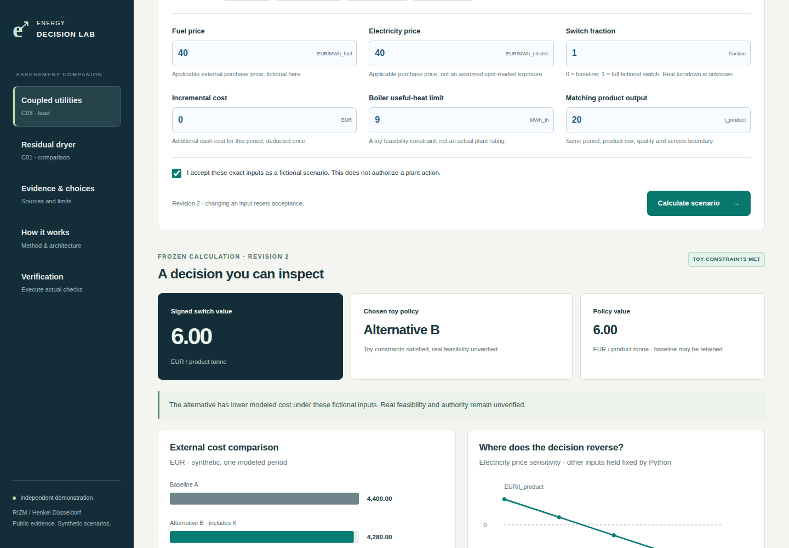
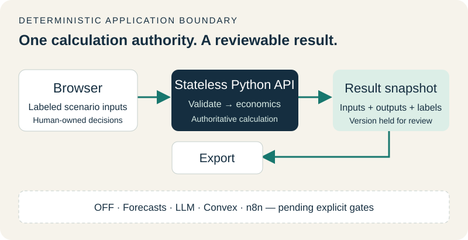
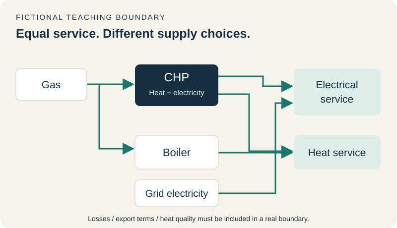

# Energy Decision Workbench

**How would you decide whether a factory should change its energy supply before you have its operating data?**

This companion to a RIZM / Henkel Düsseldorf take-home makes that starting point tangible. The assessment uses public evidence to choose decisions worth investigating. The app lets a reviewer change clearly fictional assumptions, inspect the resulting cost trade-off, and see when changing the baseline would lose money or fail a constraint.

> Heat and electricity share a system. Their costs need the same decision boundary.

**[Open the live app](https://henkel-energy-decision-workbench.vercel.app/)** · [Assessment entry point](#assessment-entry-point) · [Five-minute walkthrough](#reviewer-walkthrough) · [Architecture](#architecture) · [Verification](VERIFICATION.md)



*Actual screenshot of the deployed app. Every modeled value is synthetic; the screen demonstrates the method, not validated Henkel savings.*

## The decision behind the demonstration

| Choice | Plain-English reason |
|---|---|
| **Coupled heat and electricity leads (C03)** | Public evidence describes a shared energy system. A change in heat supply can also change fuel use and electricity purchases. Comparing the whole external bill avoids optimizing one part while making the overall choice worse. Current operating freedom remains unknown. |
| **Residual dryer improvement is a separate comparison (C01)** | Existing dryer control is already part of the baseline. The question is whether a remaining, controllable gap exists. This narrower investigation is useful if the coupled case is blocked, but its benefits cannot simply be added to C03. |
| **Forecasting is deferred (C02)** | A forecast is useful only when an authorized decision needs an unknown future input. That decision and suitable operating data have not been established here. There is no trained model or accuracy claim. |
| **One transparent calculator owns the numbers** | Python's Decimal arithmetic produces the costs, comparisons and exports. The interface displays them. A reviewer can trace a conclusion to its inputs and reproduce it without relying on generated prose. |

The documented decision trail also keeps commissioned heat export (C04) inside the coupled case and treats commercial terms (C07) as a dependency. The [ten-candidate rationale](engine/economics.md#candidate-register) explains what was retained or deferred and what evidence would reopen a case.

**Scope:** this is an independent synthetic demonstration, not RIZM software, a Henkel digital twin, an energy audit or a plant/trading connection. No live LLM runs in the calculation path. The assessment remains readable without the app.

## Assessment entry point

For the take-home itself, start with **README.md in the separately supplied six-file assessment package**, then **writeup.md**. That package also contains **economics.xlsx**, **economics.py**, **economics.md** and **sources.md**. The written argument identifies the use cases, one first-visit data request and one stakeholder; the spreadsheet and code expose the method.

This public repository is the companion application. Its [authoritative engine](engine/economics.py), [calculation trace and candidate rationale](engine/economics.md), and [dated source records](evidence/sources.md) are available here. The separate assessment-repository URL and optional video have not been supplied, so no placeholder links are presented. The original assessment edition predates the companion app; its calculations remain unchanged.

## Reviewer walkthrough

1. **Coupled utilities:** choose **Base switch**, read the units and fixed service, accept the fictional inputs and calculate. The question is whether the same useful heat, electricity and product output cost less under the alternative.
2. Choose **Higher power price**. The signed loss stays visible and the toy policy keeps the baseline. Choose **Infeasible switch** to see why an apparently attractive price cannot make an unavailable action valid.
3. **Residual dryer:** inspect a separate fictional residual improvement. Existing automatic control is the baseline. This comparison is not added to the coupled result.
4. **Evidence & choices** explains support and unknowns. **How it works** shows the teaching boundary and software architecture. **Verification** executes the actual server-side arithmetic checks.
5. Export **JSON** or **Markdown** to take the exact reviewed result with you. Editing an input resets acceptance and makes the old result stale; exports stay disabled until you calculate the new scenario.

The first-visit priority is **one existing utilities operating/dispatch report with its existing definitions**, and **the site utilities / energy operations owner**. If commercial rights determine whether any action is possible, that evidence can replace the report as the first request. Do not bundle every desired dataset into “one request.”

## Start locally

Use Node.js 22.12+ (tested with 22.23.1), npm and Python 3.12+ (standard library only). Python 3.12 is selected for Vercel. No database, API key or model-provider account is needed.

```sh
npm ci
npm run dev
```

Open `http://127.0.0.1:5173`. The command runs a loopback Python API on port 8000 and the frontend on port 5173; Ctrl+C stops both. If your Python executable differs, set `PYTHON_BIN` for that command. `.env.example` lists optional local settings; the app does not load a secrets file or need one.

For the production frontend locally, run these in separate terminals:

```sh
python3 -B scripts/serve_api.py
```

```sh
npm run build
npm run preview
```

Open `http://127.0.0.1:4173`. Do not expose the development servers to the public internet.

## Decisions and economic boundaries

| Candidate | Treatment | Why / reopen condition |
|---|---|---|
| C03 — coupled heat/electricity | Investigation lead | External fuel, power and service are coupled. Continue only if a real feasible, authorized alternative exists. |
| C01 — residual dryer | Comparison/fallback | Existing control may leave a residual gap; measured additionality, quality and controllability are unknown. |
| C04 — heat export | Nested in C03 | Commissioned infrastructure belongs in the baseline. Current toy fixture contains no export model or revenue. |
| C07 — commercial terms | Dependency | Applicable marginal prices, ownership and dispatch rights can reverse the decision. |
| C02 — forecasting | Disabled, conditional | Requires an unknown future input that affects a permitted decision, decision-time data and a checked operating policy. |
| C05 / C06 / C08–C10 | Deferred | Maintenance, production timing, warehouse, building loads and investment need specific evidence of an additional controllable opportunity. |

The authoritative [Python engine](engine/economics.py) is copied **byte-for-byte** from the reviewed assessment revision. Its SHA-256 is `b5cd866600a654b87901ef04ac308395c061fa91f69fef9bf28a9c187f8cc15d`. [The generated trace](engine/economics.md) preserves the ten-candidate rationale and calculation checks. [Sources](evidence/sources.md) preserve the approved public reference subset and its original verification dates; their inclusion does not imply a new web audit.

C03 compares a fixed fictional one-hour service: 45 MWh electricity and 45 MWh useful heat, with matching product output, mix and quality. It includes a boiler useful-heat gate and a synthetic continuous switch fraction. It is not a dispatch optimizer, validated performance curve or scheduling model. Costs include external purchased fuel and electricity once, plus incremental K once. Internal heat transfers do not create another cash debit.

C01 uses a residual gap in **directly purchased** energy per product tonne. When dryer heat comes from shared utilities, its marginal impact must be evaluated inside the joint C03 ledger. Missing actual customer economics stay unknown. The two independent values are never added.

`EUR/t_product` means euros divided by matching product tonnes in the same period and boundary. Steam tonnes and CO₂ tonnes are not substitutes. Negative switch values remain negative. An infeasible switch is unavailable, not a zero-valued feasible opportunity. The cost-only policy can retain baseline A for zero incremental benefit.

## Architecture





The implementation uses **React + Vite** for static UI assets and Python file-based functions for the API. This is a deliberate simplification of the plan's proposed Next.js frontend: this demo needs no server-rendered pages, JavaScript backend, private workspace or database. It preserves the plan's Python authority and deploys as one Vercel project. The supported [Python file-function interface](https://vercel.com/docs/functions/runtimes/python/api-directory) and [Vite deployment guide](https://vercel.com/docs/frameworks/frontend/vite) were checked during implementation. Hosting smoke tests remain distinct from a local build.

```text
Browser (ephemeral inputs and acceptance)
  → same-origin POST /api/calculate
  → strict Python adapter → frozen Decimal economics engine
  → checks + trace + sensitivity + source/method/input hashes
  → frozen JSON snapshot + server-rendered Markdown
  → UI formatting, charts and download (no new financial calculation)
```

| Component | Implemented responsibility |
|---|---|
| Planner | The explicit C03/C01 workflow and missing-input state guide the next step. No autonomous planning model. |
| Evidence | Curated, dated records with stable IDs and limitations. No live crawling or document ingestion. |
| Calculator | `engine/economics.py`; adapter validates requests and delegates arithmetic. All economic computations, including presentation aggregates, remain in Python. |
| Verifier | Executed engine assertions, adapter parity and separate API/browser tests. Independent agent review is recorded separately. |
| Forecaster / LLM | Not enabled. No model-quality badge, synthetic customer-accuracy claim, paid call or fabricated conversational agent. |

The adapter accepts only versioned, explicitly synthetic requests and exact decimal strings. Required fields, units, finite values, positive product output, cost/constraint ranges, bounded magnitude and request size are enforced server-side. Unknown fields, client overrides of the service boundary and incorrect tonne units are rejected. Expected validation errors are safe messages; unexpected errors do not return stack traces.

A result includes original inputs, units, revision, confirmation scope, calculated metrics, trace, sensitivity, source/method/adapter hashes and actual check results. Hashes identify content; they are not cryptographic signatures or customer authorization. Snapshot IDs identify the calculation inputs and code/evidence revisions; execution timestamps are separate. Nothing is stored on a server or in browser local storage.

Every input edit invalidates prior acceptance and results. In-flight requests are aborted and revision-checked so old responses cannot overwrite newer edits. Unchecking acceptance disables export until reaccepted. The UI requests confirmation, but the public endpoint is not authenticated: this confirmation has no authority beyond a fictional calculation.

## Tests and acceptance

```sh
python3 -B engine/economics.py --check
npm run test:python
npm run build
npx playwright install chromium
npm run test:e2e
```

`npm run check` runs the Python suite, TypeScript/production build and browser suite. Browser tests start and stop their own local servers; ports 8000 and 5173 must be free. The Python HTTP tests use an ephemeral loopback port. Test screenshots and traces are ignored by Git.

| Acceptance fixture | Required result |
|---|---|
| C03 G=40, P=40, K=0, Q=20, fraction=1, boiler limit=9 | Net 120 EUR; 6 EUR/t_product; choose B |
| C03 P=120 | Signed −440 EUR; −22 EUR/t_product; choose A, policy value zero |
| C03 fraction=0.25, K=60 | Signed −30 EUR; −1.50 EUR/t_product; K held fixed |
| C03 boiler useful-heat limit=8 | Infeasible; no admissible signed EUR/t_product |
| C01 gaps=0.01 fuel and 0.002 electricity, G=40, P=120, Q=20, K=6 | 0.34 EUR/t_product |
| C01 K=15 / K=12.8 | −0.11 / zero EUR/t_product |
| Missing input, zero output, invalid units, unsupported metadata, non-finite value | Reject; no fabricated successful calculation |

The browser suite compares the API result, visible value, downloaded JSON and downloaded Markdown for all seven primary fixtures. It additionally exercises stale acceptance, missing/zero values, delayed responses, server failure, negative prices, changed denominators, evidence, diagrams and narrow-screen layout. The browser converts numbers only for display and chart coordinates, never to calculate financial results.

The included GitHub Actions workflow runs the same checks on Linux, using read-only repository permissions and pinned action commits. [The initial implementation run passed](https://github.com/harshjoshi23/henkel-energy-decision-workbench/actions/runs/36244908051): 29 Python tests, the production build and 12 browser tests. See the verification record for the tested revision.

See [VERIFICATION.md](VERIFICATION.md) for actual executed results and remaining limitations. A passing local suite does not certify deployment, capacity, a real plant or RIZM's hiring scorecard.

## Deployment and rollback

`vercel.json` configures the Vite build and two stdlib Python functions, with security headers and bounded function duration. Python 3.12 is pinned through `.python-version`. No secrets are required. Ignored `.vercel/` files belong to the chosen local hosting account, not the public repository.

The live project is `henkel-energy-decision-workbench` in the owner-confirmed personal workspace `harshjoshi23s-projects`. Both Python functions and the public UI were verified without authentication. Vercel assigned the first deployment to production automatically. It was then tested in place; this was not a preview promotion.

GitHub auto-connection failed through the hosting CLI; the app was deployed successfully through the CLI. A Git push currently runs CI but does **not** automatically update hosting. The owner can connect this exact repository under the project’s Git settings later. Do not confuse CI success with a new deployment.

For future changes, use the existing linked project:

```sh
npx vercel@60.1.3 login
npx vercel@60.1.3 link --project henkel-energy-decision-workbench --scope harshjoshi23s-projects
npx vercel@60.1.3 deploy --scope harshjoshi23s-projects
```

Review the preview deployment and run the browser suite against its URL:

```sh
PLAYWRIGHT_BASE_URL=https://your-approved-preview.vercel.app npm run test:e2e
```

To repeat checks on the current public deployment:

```sh
python3 -B scripts/smoke_hosted.py --base-url https://henkel-energy-decision-workbench.vercel.app
PLAYWRIGHT_BASE_URL=https://henkel-energy-decision-workbench.vercel.app npm run test:e2e
```

The manual **Verify public deployment** GitHub workflow runs these same checks without secrets. The passing hosted run contains 22 HTTP/API/export smoke checks and all 12 browser tests. The original hosted run found a delayed-request teardown race in the test; the corrected test waits for completion before asserting stale UI state, and the full rerun passed.

For later releases, only after preview verification, promote or deploy production. If preview protection blocks ordinary reviewers or tests, resolve access in the authorized project settings; do not publish access tokens in URLs. Check both Python endpoints and the actual exports, not just the landing page. A static-only host cannot run this app's economics API.

Use Vercel's project deployment history / rollback to restore the last independently checked deployment if a later version fails. For the first release, remove the public alias or stop sharing the demo if no earlier checked deployment exists. No database migration or plant action needs reversing. Deployment status and URLs are recorded only when actually established in `VERIFICATION.md`.

There are no paid model calls. Request size and duration are bounded; this repository does not implement authenticated tenant quotas or claim load-tested production capacity. Use hosting spend limits and rate protection appropriate to the public project. The application never requests credentials or private customer data.

## Repository map

```text
README.md                   Setup, rationale, usage, architecture and deployment
VERIFICATION.md             Executed release checks and limitations
src/                        React UI, evidence and architecture views, styles
api/                        Vercel Python entry points
engine/economics.py          Frozen authoritative assessment calculation engine
engine/economics.md          Matching generated trace and ten-candidate rationale
engine/adapter.py            Strict API contract, snapshots, traces and exports
evidence/sources.md         Approved public source extract
public/diagrams/             Accessible SVG energy and software diagrams
scripts/                    Local dev/API runners and public deployment smoke checker
tests/                      Python/HTTP checks and browser parity tests
.github/workflows/          Local CI and manual hosted checks; no deployment permissions
package.json / package-lock.json   Pinned frontend and test dependencies
vercel.json / .python-version     Deployment/runtime configuration
.env.example / .gitignore / .vercelignore   Safe configuration and publication exclusions
```

The full research repository, private collaborator notes, correspondence, archives, third-party research runtime, agent transcripts and original Git history are deliberately absent. Reusable reasoning is retained as concise rationale, source records, code, tests and this handover-friendly map.

## Render and future compute

Vercel remains the live host. Render is reserved for future forecasting or evaluation jobs once the decision/data gates below are met. No Render service, second runtime or paid resource was created for this release. Adding another host is not required to review the current workbench. Any future worker must preserve the same Python authority, versioned input/output contract, human approval and measured evaluation gates.

## What comes next, if evidence justifies it

- **Forecasting:** establish a named permitted action, decision time, target/horizon and data provenance. A future 24-hour useful-heat forecast needs a demand-responsive feasible policy; the current one-period model is insufficient. Compare chronological baselines and candidates on the same realized operating cost, not just prediction error. Until then, leave it off.
- **Bounded AI explanation:** read only approved evidence and frozen traces; cite or abstain. Proposed edits require explicit acceptance and a new calculation. Grounding, injection, staleness, outage and cost-limit evaluations must precede enablement. An LLM never owns the money arithmetic.
- **Convex:** add only for real persistent collaboration/private access; then test authorization per object. **n8n:** use a single job owner and replay-safe human-approved workflows. **ElevenLabs:** optional narration after recording a reviewed build. None is part of this runtime.

## Disclosure

Public evidence and a synthetic assessment engine were reused. Codex coordinated bounded implementation work for the Python adapter, evidence/diagrams and independent verification; React/TypeScript, Python Decimal, Vite, Playwright, Git/GitHub CLI and Vercel CLI support development and release. No source-reading claims are made on behalf of the assessment owner. No LLM runs in the deployed calculation path. Real customer performance, tariffs, output and operating rights remain unknown. The assessment owner retains final choices, video narration and submission control.
